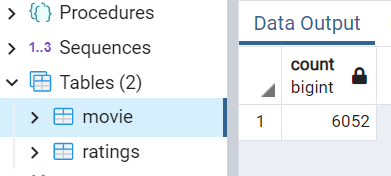
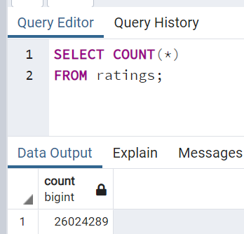

# Movies-ETL

## Overview of the challenge
Amazing Prime wants to do a hack-a-thon challenge. In order to do this, data files need to be prepare to the users. This challenge is about the ETL process of data cleaning. ETL stands for "Extract, Transform, and Load". The challenge is to clean up movie rating files extracted from the web in various forms, such as json and csv. 

## Result
After the transformation, the data was connected to the SQL server as the final step in the challenge. Using SQL, the movie and rating files were able to be upload and count. The rating file was such a massive file that the row counts were staggering. See below for the actual count.

#### Movies Row Count

#### Ratings Row Count

